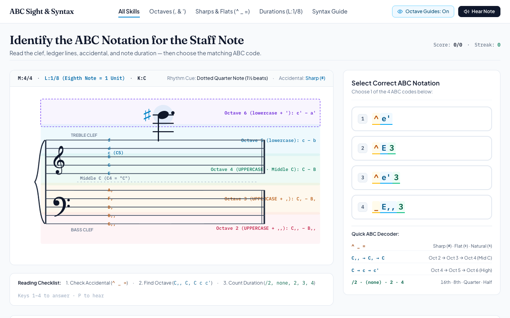

# ABC Sight & Syntax — Music Notation Trainer

[](https://benjaminpritchard.github.io/abc_notation_quiz/)

An interactive web-based trainer and quiz for mastering **ABC music notation** syntax (octaves, accidentals, and durations) mapped directly to standard grand staff notation.

> 🌐 **Play it live**: [https://benjaminpritchard.github.io/abc_notation_quiz/](https://benjaminpritchard.github.io/abc_notation_quiz/)

---

## Screenshot



---

## About & AI Generation

This application was generated by **Google Gemini** using the **Gemini 2.5 Flash** model via Google AI Studio. 

It is a 100% client-side application built with modern web technologies:
- **Audio**: Pure browser-synthesized sound using the Web Audio API (no external soundfonts or audio files required).
- **Notation**: Canvas and SVG grand staff rendering supporting treble & bass clefs, ledger lines, accidentals, and note durations.
- **Frontend**: React 19, TypeScript, Tailwind CSS, Motion, and Lucide Icons.

---

## Features

- **Grand Staff Sight Reading**: Read notes across the grand staff with color-coded octave guides that help connect staff positions to ABC pitch symbols.
- **Comprehensive ABC Notation Practice**:
  - **Octaves**: Master lowercase/uppercase letters, commas, and apostrophes (`C,,`, `C,`, `C`, `c`, `c'`).
  - **Accidentals**: Practice prefixes for sharps (`^`), flats (`_`), and naturals (`=`).
  - **Durations**: Learn rhythm multiplier syntax (`/2` sixteenth, default eighth, `2` quarter, `3` dotted quarter, etc.).
- **Interactive Audio Feedback**: Hear the notes synthesized in real time via the Web Audio API.
- **Targeted Training Modes**: Practice specific areas (All Skills, Octaves, Sharps & Flats, Durations) or browse the built-in ABC Syntax Reference drawer.
- **Keyboard Shortcuts**: Use keys `1`-`4` to answer and `P` to replay note audio.

---

## Running Locally

1. **Install dependencies**:
   ```bash
   npm install
   ```

2. **Start development server**:
   ```bash
   npm run dev
   ```
   Open [http://localhost:3000](http://localhost:3000) in your browser.

3. **Build static bundle**:
   ```bash
   npm run build
   ```
   The production-ready static assets will be compiled into the `dist/` directory.
